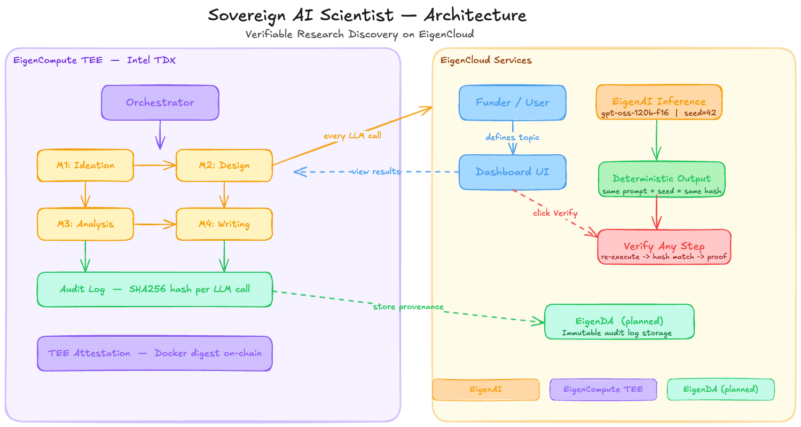

# 🔬 Sovereign AI Scientist

**Autonomous research agent with cryptographic proof of execution — built on EigenCloud.**

> *"Fund an agent that provably does what it's funded to do."*  
> Every hypothesis generated, every experiment designed, every paper written — independently verifiable.  
> Removes counterparty risk from science funding.

[🚀 **Live Demo**](#) &nbsp;·&nbsp; [📹 **Demo Video**](#) &nbsp;·&nbsp; [🐦 **Tweet**](#)

---

## The Problem

Labs struggle to raise funding because backers **can't verify the work was done**.  
A researcher takes a grant, runs experiments, returns with results. You have to trust them.  
This is classic counterparty risk — and it's why science funding is slow, conservative, and bureaucratic.

## The Solution

An autonomous AI research agent where **every single decision is cryptographically verifiable**.

- A funder defines a research program (topic, model, seed)
- The agent autonomously generates hypotheses, designs experiments, analyzes results, and writes papers
- **Every LLM call is hashed** — prompt hash + output hash + step ID logged
- **Anyone can re-execute any step** on EigenAI with the same seed → identical output
- Matching hashes = cryptographic proof the agent did exactly what it claimed

This is not logging. This is **verifiable compute**.

---

## Architecture



---

## How We Use EigenCloud

| Component | Usage | What It Proves |
|-----------|-------|----------------|
| **EigenAI** | All LLM inference — `gpt-oss-120b-f16`, seed pinned at 42 | Same prompt + same seed = bit-exact identical output. Anyone can re-execute and verify. |
| **EigenCompute** | Agent deployed in Intel TDX TEE | Hardware attestation proves the exact committed Docker image is what ran — not tampered code |
| **EigenDA** | Audit log dispersal *(designed — pending TEE sidecar deploy)* | Immutable permanent provenance — artifacts can never be altered or deleted |

### Why EigenAI specifically?

Standard LLM APIs (OpenAI, Anthropic) are **non-deterministic by design** — the same prompt returns different outputs on different calls. This makes verification impossible.

EigenAI guarantees **bit-exact reproducibility**: given the same model, prompt, and seed, the output is **identical every single time**. This is not caching — it is a core design property of their inference stack. It's what makes "re-execute and verify" meaningful.

The model we use — `gpt-oss-120b-f16` — is accessed via EigenAI's OpenAI-compatible endpoint with wallet-based grant authentication from [deTERMinal](https://determinal.eigenarcade.com).

---

## Verification Flow

```
Funder defines topic + seed
         │
         ▼
Agent executes in EigenCompute TEE
         │
         ▼
Every LLM call → EigenAI (model=gpt-oss-120b-f16, seed=42, temp=0)
         │                    │
         ▼                    ▼
   prompt hashed        output hashed
         │                    │
         └──────┬─────────────┘
                ▼
         Audit Log entry
     { step_id, prompt_hash,
       output_hash, model, seed }
                │
                ▼
    Funder clicks "Verify" on any step
                │
                ▼
    EigenAI re-executes same prompt + same seed
                │
                ▼
    output hash matches ✓  ← cryptographic proof
```

---

## Research Pipeline

The agent runs a complete 4-milestone research program autonomously:

| Milestone | What Happens | EigenAI Calls |
|-----------|-------------|---------------|
| **M1: Ideation** | Generates 3 hypotheses, scores novelty for each, selects highest-scoring | 4 calls |
| **M2: Design** | Full experiment design + Python implementation code | 2 calls |
| **M3: Analysis** | Evaluates simulated results, determines statistical significance | 1 call |
| **M4: Writing** | Writes academic abstract with specific metrics and citations | 1 call |

Every step produces a verifiable audit entry. Total: **8 verifiable steps** per run.

---

## Quick Start

### Prerequisites

- Python 3.11+
- An Ethereum wallet (MetaMask or any standard wallet)
- Node.js 18+ (for EigenCompute deployment)

### 1. Get EigenAI Access (free 1M tokens)

EigenAI uses wallet-based grant authentication instead of API keys.

```bash
# 1. Go to https://determinal.eigenarcade.com
# 2. Connect your X (Twitter) account
# 3. Connect your Ethereum wallet
# 4. You receive 1M free inference tokens for gpt-oss-120b-f16
```

No API key to manage. Your wallet signs a grant message that authenticates each request.

### 2. Configure

```bash
git clone https://github.com/YOUR_USERNAME/sovereign-ai-scientist
cd sovereign-ai-scientist

cp .env.example .env
# Edit .env and add your wallet credentials:
#   WALLET_ADDRESS=0x...
#   WALLET_PRIVATE_KEY=0x...
```

### 3. Run locally

```bash
pip install -r requirements.txt
uvicorn server:app --host 0.0.0.0 --port 8080
# Open http://localhost:8080/app
```

### 4. Run with Docker

```bash
docker build -t sovereign-scientist:v1 .
docker run -p 8080:8080 --env-file .env sovereign-scientist:v1
# Open http://localhost:8080/app
```

---

## Deploy to EigenCompute TEE

EigenCompute runs your Docker image inside an **Intel TDX Trusted Execution Environment**. The hardware produces an attestation proving the exact image digest that is running — no operator can swap in different code.

### Requirements

- `Dockerfile` must use `--platform=linux/amd64` and `USER root` ✓ (already set)
- App must bind to `0.0.0.0` ✓ (already set in `server.py`)
- Public GitHub repo (required for verifiable source builds)

### Deploy steps

```bash
# Install EigenCloud CLI
npm install -g @layr-labs/ecloud-cli

# Authenticate with your wallet
ecloud auth login
# → Enter your WALLET_PRIVATE_KEY when prompted
# → Stored securely in OS keyring

# Deploy from your public GitHub repo
ecloud compute app deploy --env-file .env --name sovereign-scientist
# → Select: Build from git source (verifiable)
# → Enter your GitHub repo URL
# → CLI builds linux/amd64, pushes to EigenCloud registry, starts TEE instance

# Get your live URL + attestation data
ecloud compute app info
# → Returns: App URL, Docker image digest (sha256:...), App ID
```

### What you get after deployment

- **Live public URL** — share with judges, funders, anyone
- **Docker image digest** — `sha256:abc123...` proving exactly what code ran
- **TEE attestation** — Intel TDX hardware proof, verifiable by anyone
- **App ID** — permanent identifier for the deployed agent

---

## Demo

**What a judge sees:**

1. Open the live URL
2. The research topic is pre-filled: *"Novel extensions to Robust Policy Improvement: combining distributional value estimation with conservative policy updates for offline settings"*
3. Click **Launch Agent** → watch 4 milestones complete in real time
4. Audit trail populates with 8 steps, each showing `prompt_hash` and `output_hash`
5. Click **⟳ Verify** on any step → EigenAI re-executes live → hashes match → **✓ Verified**
6. Provenance Complete banner shows: 8 verifiable steps, model, seed

This is real RL research — not a toy example.

---

## Why This Matters for DeSci

| Without Sovereign AI Scientist | With Sovereign AI Scientist |
|-------------------------------|----------------------------|
| Trust the researcher | Verify the execution |
| Manual milestone review | Cryptographic proof per step |
| Funds released on faith | Funds released on verified hashes |
| Opaque methodology | Full audit trail, re-executable |
| Slow, conservative funding | Fast, trustless capital formation |

DAOs, biotech VCs, DeSci protocols, and grant committees can now fund research programs with **mathematical guarantees** — not just reputational trust.

---

## Tech Stack

- **Python 3.11** + FastAPI — research orchestration backend
- **EigenAI** — `gpt-oss-120b-f16` via OpenAI-compatible endpoint, deterministic inference
- **deTERMinal** — wallet grant authentication for EigenAI access
- **EigenCompute** — Intel TDX TEE deployment via `ecloud` CLI
- **eth-account** — wallet signing for grant authentication
- **Docker** (`linux/amd64`) — TEE-ready container
- **Vanilla HTML/CSS/JS** — zero-dependency single-file dashboard

---

## Repository Structure

```
sovereign-ai-scientist/
├── agent/
│   ├── scientist.py      # Core pipeline: 4 milestones, EigenAI calls, verification
│   └── __init__.py
├── frontend/
│   ├── app.html          # Research dashboard (single file, no build step)
│   └── index.html        # Landing redirect
├── server.py             # FastAPI backend — research API + verification endpoints
├── Dockerfile            # linux/amd64, USER root — TEE-ready
├── requirements.txt
├── architecture.png      # System architecture diagram
├── .env.example          # Credentials template — see Setup above
└── .gitignore            # .env excluded — never committed
```

---

## Future Work

- **On-chain escrow** — milestone-gated fund release; funds unlock only on verified hash submission to smart contract
- **EigenDA integration** — disperse full audit logs for permanent tamper-proof availability
- **ERC-8004 agent identity** — register the agent on-chain with verifiable, discoverable identity  
- **Real experiment execution** — run actual ML training inside TEE, hash stdout/stderr as proof
- **Multi-agent review** — Virtual Lab-style debate rounds for hypothesis refinement, all verifiable

---

## Acknowledgements

- [EigenCloud](https://eigencloud.xyz) — EigenAI, EigenCompute, EigenDA infrastructure
- [deTERMinal](https://determinal.eigenarcade.com) — Wallet grant system for EigenAI token access
- [AI-Scientist-v2](https://github.com/SakanaAI/AI-Scientist-v2) — Inspiration for agentic scientific discovery pipelines

---

## License

MIT

---

*Built for the [EigenCloud Open Innovation Challenge](https://ideas.eigencloud.xyz/)*  
*Removing counterparty risk from science funding — one verifiable step at a time.*
